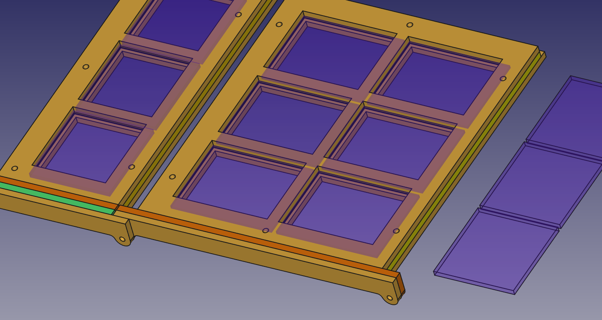
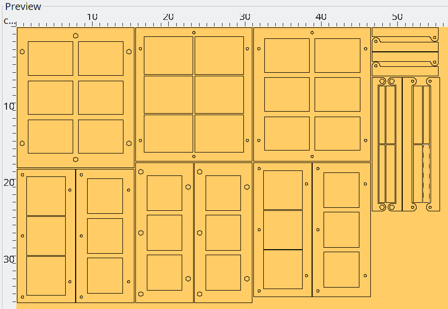

# glass_holder_4x3_foldable
a simple ply-wood frame for 4x3 small / thin (50x50x3mm &amp; 63x48x2mm) glass plates

## Needed Material

- ply-wood (555x365x4mm)
    - frame top
        - 1x [ftop_bottom.dxf](export/ftop_bottom.dxf)
        - 1x [ftop_mid.dxf](export/ftop_mid.dxf)
        - 1x [ftop_top.dxf](export/ftop_top.dxf)
        - 2x [ftop_joint_in.dxf](export/ftop_joint_in.dxf)
        - 2x [ftop_joint_out.dxf](export/ftop_joint_out.dxf)
    - frame side (2x)
        - 1x [fside_bottom.dxf](export/fside_bottom.dxf)
        - 1x [fside_mid.dxf](export/fside_mid.dxf)
        - 1x [fside_top.dxf](export/fside_top.dxf)
        - 2x [fside_joint_in.dxf](export/fside_joint_in.dxf)
        - 2x [fside_joint_mid.dxf](export/fside_joint_mid.dxf)
        - 2x [fside_joint_out.dxf](export/fside_joint_out.dxf)
- screws
    - 20x (6+5+5+4) M3x10mm
    - 20x (6+5+5+4) M3 nut

---
# License
all Software in this repository is license under MIT License (see [LICENSE file](LICENSE))

all HW / Design files are licensed as CC-BY

<!-- License info -->
 

    glass_holder_4x3_foldable

by
<a xmlns:cc="http://creativecommons.org/ns#" href="https://github.com/s-light/LEDBoard_Layout_Sun" property="cc:attributionName" rel="cc:attributionURL">
    Stefan Krüger (s-light)
</a>
is licensed under a
<a rel="license" href="http://creativecommons.org/licenses/by/4.0/">
    Creative Commons Attribution 4.0 International License
</a>.
